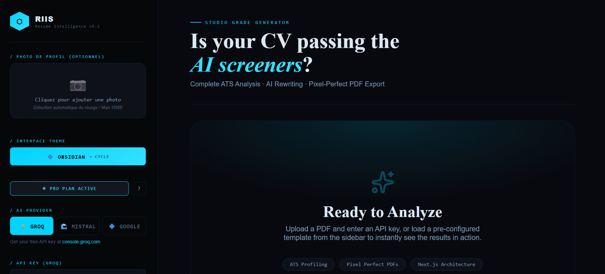

# ⬡ RIIS — Resume Improve Intelligence Studio

**Stop sending your CV into the "Resume Black Hole".** 

75% of applications are rejected by automated bots before a human ever sees them. RIIS is a high-performance utility designed to audit, rewrite, and export your CV so it bypasses tracking systems (ATS) and lands directly on a recruiter's desk.

🌐 **Live Demo**: [https://riis.onrender.com/](https://riis.onrender.com/)



---

## 🚀 The Value Proposition

| Utility | Real-World Impact |
| :--- | :--- |
| **ATS Forensic Audit** | Identifies why robots (Workday, Taleo, iCIMS) are flagging your CV. |
| **Psychological Insights** | AI analyzes why a human recruiter might ignore or underpay you. |
| **Market Value Benchmarking** | Estimates your salary potential and identifies the "Salary Gap". |
| **Semantic Keyword Injection** | Automatically matches your skills to the specific job offer context. |
| **CV Studio Pro** | Generates pixel-perfect PDFs in 32 premium themes with full customization. |
| **Profile Photo Integration** | Upload and embed professional photos in 10 specialized photo-enabled themes. |
| **3 AI Providers** | Choose between Groq, Mistral AI, or Google AI (Gemini) for analysis. |

---

## 🛠️ Core Utility Features

### 🔍 Deep Audit & Scoring
Don't guess your chances. Get a precise **Score (0-100)**, a **Pass Probability**, and a **Market Verdict**. RecruitIQ scans for:
- **Missing Keywords**: Specific technical and soft skills the ATS is looking for.
- **Content Density**: Evaluates if your experience matches the seniority level.
- **Recruiter Psychology**: Explains the "Shadow Profile" you present to hiring managers.

### 🧠 Intelligent AI Rewriting
Powered by **3 AI Providers** (Groq, Mistral AI, Google AI), RIIS doesn't just "fix" your CV; it transforms it:
- **Boost Mode**: Enriches your experience with hidden accomplishments relevant to the job.
- **Dual Language**: Seamlessly translate and optimize between French and English.
- **Visual Edition**: Use the **Live Editor** to click any part of your PDF and edit the text directly.

### 🎨 The PDF Engine (Python Worker)
Most "beautiful" CVs (Canva/Design) fail ATS because they aren't readable by machines. Our Python backend uses **ReportLab** to draw exact coordinates:
- **32 Premium Themes**: 16 standard themes + 10 photo-enabled themes + 6 ATS-optimized themes
- **Customization Studio**: Real-time control over:
  - **Accent Colors**: Primary, secondary, and tertiary color schemes
  - **Typography Colors**: Name, headings, subheadings, and body text
  - **Background Colors**: Main body, sidebar, and header backgrounds
  - **Photo Border Colors**: Customize borders on all 10 photo themes
  - **Font Scale**: Adjust text size from 50% to 200% while maintaining layout integrity
- **ATS-Optimized**: Every PDF produced is 100% text-extractable with proper Unicode mapping.
- **Photo Support**: Upload profile photos (JPG/PNG) with automatic processing:
  - Smart cropping and centering
  - Face detection and optimization
  - Circular or square rendering based on theme
  - Customizable border colors and widths

---

## 🎭 Theme Categories

### Standard Themes (16)
Professional layouts without photo integration:
- **Classic Dark**: Elegant sidebar with gold accents
- **Canva Minimal**: Clean white design with coral highlights
- **Nordic Clean**: Scandinavian-inspired pastel aesthetics
- **Tech Grid**: Dark mode with geometric grid patterns
- **Luxury Serif**: Premium serif typography for consulting
- **Finance Pro**: Navy and gold for financial sector
- **Medical Clean**: Aqua accents for healthcare professionals
- **BTP Industry**: Safety orange for construction/engineering
- **Apprentice**: Vibrant yellow for entry-level positions
- **Startup SaaS**: Violet and pink for tech startups
- **Academic Legal**: Monochrome professional for law/academia
- **Creative Agency**: Rose tones for creative industries
- **Logistics**: Navy and green for supply chain
- **Retail Sales**: Bold red for sales positions
- **Executive C**: Slate gray for C-level executives
- **SOTA Luxury**: Champagne gold ultra-premium design

### Photo-Enabled Themes (10)
Specialized layouts with integrated profile photos:
- **Executive Portrait**: Round photo in premium header (corporate)
- **Modern Profile**: Large sidebar photo with tech styling
- **Creative Vision**: Artistic diagonal layout with colored overlay
- **Finance Executive**: Formal photo with finance color palette
- **Tech Leader**: Modern sidebar with tech accents
- **Startup Founder**: Dynamic photo with innovative layout
- **Consultant Premium**: 3-column layout with centered photo
- **Corporate Elite**: Asymmetric header with photo integration
- **Minimalist Pro**: Ultra-clean design with small aligned photo
- **International Profile**: Sidebar with square photo and progress bars

---

## ⚡ Quick Start (Self-Host)

### Prerequisites
- Node.js 20+
- Python 3.11+
- At least one API Key: [Groq](https://console.groq.com) (Free) or [Mistral](https://console.mistral.ai) or [Google AI](https://aistudio.google.com/apikey)

### Installation
```bash
# 1. Clone & Install Python Backend
pip install -r requirements.txt

# 2. Start Next.js Frontend
cd web
npm install
npm run dev
```
Navigate to `http://localhost:3000` to start your audit.

---

## 🚀 Deployment (Render.com)

🌐 **Live Demo**: [https://riis.onrender.com/](https://riis.onrender.com/)

### One-Click Deploy
[](https://render.com)

### Manual Deployment
1. **Fork this repository** to your GitHub account
2. **Create a new Web Service** on [Render.com](https://render.com)
3. **Connect your GitHub repository**
4. **Configure Environment Variables**:
   ```
   GROQ_API_KEY=your_groq_key_here
   MISTRAL_API_KEY=your_mistral_key_here (optional)
   GOOGLE_API_KEY=your_google_key_here (optional)
   PORT=10000
   ```
5. **Deploy Settings**:
   - **Build Command**: (Handled by Dockerfile)
   - **Start Command**: (Handled by Dockerfile)
   - **Docker**: Enabled (uses `Dockerfile` in root)

### Post-Deployment Notes
- **Cold Start**: On Render's free tier, the service sleeps after 15 minutes of inactivity
- **First Load**: May take 30-60 seconds to wake up the service
- **Dynamic Rendering**: RIIS uses `force-dynamic` to prevent static caching issues
- **No Reload Needed**: Once the service is awake, all API calls work immediately

### Troubleshooting Render Deployment
- **503 Error on first load**: Normal - service is waking up from sleep
- **API calls failing**: Check environment variables are set correctly
- **PDF generation timeout**: Increase timeout in Render settings (paid plans)
- **Port issues**: Ensure `PORT=10000` is set in environment variables

---

## 🏗️ Architecture: How the Utility Works
RIIS operates as a dual-agent pipeline:
1. **The Auditor**: Extracts text (pdfminer) and performs a competitive analysis.
2. **The Architect**: Restructures the data into a normalized JSON schema.
3. **The Worker**: A dedicated Python process renders the JSON into a high-fidelity PDF.
4. **The Photo Processor**: Handles profile photo uploads with face detection and optimization.

### Technical Stack
- **Frontend**: Next.js 14 (App Router), React, TypeScript, Tailwind CSS
- **Backend**: Python 3.11, FastAPI, ReportLab (PDF generation)
- **AI Engine**: Groq API / Mistral AI / Google AI (Gemini)
- **PDF Processing**: pdfminer.six for text extraction
- **Image Processing**: Pillow with face detection for photo optimization
- **Deployment**: Docker-ready with Render.com support

### Performance Optimizations
- **Force Dynamic Rendering**: Prevents static caching issues on serverless platforms
- **No-Cache Middleware**: Ensures fresh API responses on every request
- **Standalone Output**: Optimized Docker builds for faster cold starts
- **In-Memory Processing**: Zero database overhead for maximum speed

---

## 🎨 Customization Features

### Color Customization
Every theme supports granular color control:
- **Accent Color**: Primary brand color (buttons, highlights, icons)
- **Text Color**: Body text and general content
- **Heading Color**: Section titles and major headings
- **Subheading Color**: Job titles and secondary headings
- **Name Color**: Your name in the header
- **Sidebar Background**: Left panel background (sidebar themes)
- **Main Background**: Primary content area background
- **Header Background**: Top section background
- **Photo Border Color**: Border around profile photos (photo themes only)

### Font Scale
Adjust text size from 0.5× to 2.0× while maintaining:
- Proportional spacing and margins
- Consistent line heights
- Proper element alignment
- No text overflow or collisions

### Photo Upload
1. Click "Upload Photo" in CV Studio
2. Select JPG or PNG (max 5MB)
3. Automatic processing:
   - Face detection and centering
   - Smart cropping to square format
   - Optimization for print quality
4. Photo appears in all 10 photo-enabled themes
5. Customize border color per theme

---

## 🛡️ Privacy & Performance
- **Zero Data Retention**: Your CV data is processed and returned in-memory.
- **Sub-Second AI**: Groq LPU technology ensures analysis is finished in under 2 seconds.
- **Pixel Perfection**: No blurry images. Pure vector-based PDF generation.
- **Local Processing**: Photos processed locally, never stored on servers.
- **ATS-Safe Photos**: Photos embedded as proper image objects with text layers intact.

---

## 📋 Workflow Example

1. **Upload CV**: Drop your existing PDF or Word document
2. **Paste Job Offer**: Copy the job description you're targeting
3. **AI Analysis**: Get instant ATS score and improvement suggestions
4. **AI Rewrite** (Optional): Let AI optimize your content for the role
5. **Choose Theme**: Select from 26 professional themes
6. **Upload Photo** (Optional): Add profile photo for photo-enabled themes
7. **Customize**: Adjust colors, fonts, and styling
8. **Export**: Download ATS-optimized PDF ready for submission

---

## 🔧 Advanced Features

### Live PDF Editor
- Click any text element in the preview
- Edit content directly in the PDF
- Changes reflect immediately
- Maintains ATS compatibility

### Multi-Language Support
- French and English interfaces
- AI translation between languages
- Locale-specific formatting

### Cover Letter Generator
- AI-powered cover letter creation
- Matches CV theme and styling
- Personalized to job description
- Professional formatting

---

## License
MIT
